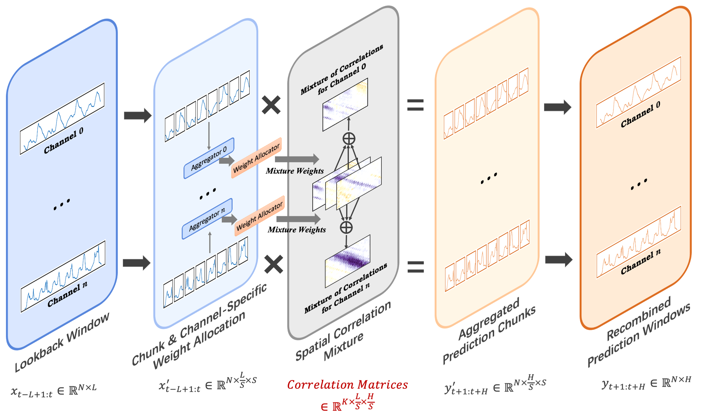
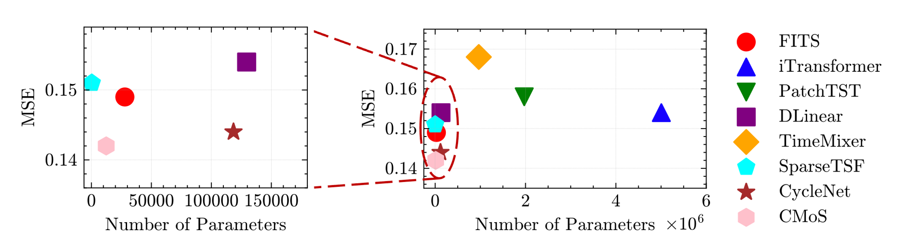

# CMoS: Rethinking Time Series Prediction Through the Lens of Chunk-wise Spatial Correlations
The repo is the official implementation for the paper: CMoS: Rethinking Time Series Prediction Through the Lens of Chunk-wise Spatial Correlations (ICML'25).



## Introduction

CMoS is a super-lightweight model (1%～20% of DLinear's parameter count) designed for long-term multivariate time series prediction. 
Two techniques are introduced to achieve better performance and robustness with fewer model parameters:
1. **Chunk-wise spatial correlation modeling**. Both input series and series to be predicted are split into chunks, and CMoS focuses on modeling the relationships between these input and output chunks via mapping matrices. This technique carries performance and efficiency advantages theoretically and empirically.
2. **Correlation Mixing**. We decompose the spatial correlation matrix of each time series into a combination of several foundational matrices, which are shared across all time series. In a system comprising n time series, this strategy enables the model to capture diverse temporal patterns while reducing the parameter complexity from beyond O(n) to O(1). Additionally, the learned foundational matrices offer strong interpretability, aiding in the discovery of key temporal dynamics in the system.


Additionally, we propose **Periodictiy Injection** technique. By directly editing the initial weights of one foundation correlation matrix, we can inject some priori period knowledge to the model. This makes CMoS more easier to model the periodic spatial correlations, thereby speeding up convergence and enhancing the performance for time series with great periodicity.

<p align="center">

</p>

## Performance and Efficiency
### Overall Performance

### Efficiency
Comparison of the prediction performance and parameter count between CMoS and other baselines on Electricity dataset with horizon=192.

<p align="center">

</p>

## Interpretability
We visualized four spatial correlation matrices, which are also referred to as correlation mappings, that are learned from the weather dataset without periodicity injection. The visualization analysis reveals that each spatial correlation mapping captures and emphasizes distinct patterns of temporal dependencies, which can help understand the inherent patterns of the whole system.

<p align="center">

</p>

## Getting Started
### Enviroment
Conda is recommended to create a virtual environment for this repo:
```
conda create -n CMoS python=3.9
conda activate CMoS
conda install pytorch==2.0.1 torchvision==0.15.2 torchaudio==2.0.2 pytorch-cuda=11.8 -c pytorch -c nvidia
pip install -r requirements.txt
```

### Scripts
You can run the example script for each dataset to validate the environment. For example, for electricity dataset, you can run the following script:
```
./scripts/electricity.sh
```

To get the best result, run the grid search script for each dataset (e.g. electricity):
```
./scripts/electricity_search_best.sh
```

The results can be found in `model/CMoS/cpkt/{dataset}-{pred_len}/log.txt`

## Citation
If you find this repo useful, please cite our paper.
```
@inproceedings{si2025CMoS,
  title={CMoS: Rethinking Time Series Prediction Through the Lens of Chunk-wise Spatial Correlations}, 
  author={Si, Haotian and Pei, Changhua and Li, Jianhui and Pei, Dan and Xie, Gaogang},
  booktitle={Forty-second International Conference on Machine Learning},
  year={2025}
}
```

## Acknowledgement
We appreciate the following GitHub repos a lot for their valuable code and datasets.

https://github.com/thuml/Time-Series-Library
https://github.com/lss-1138/SparseTSF